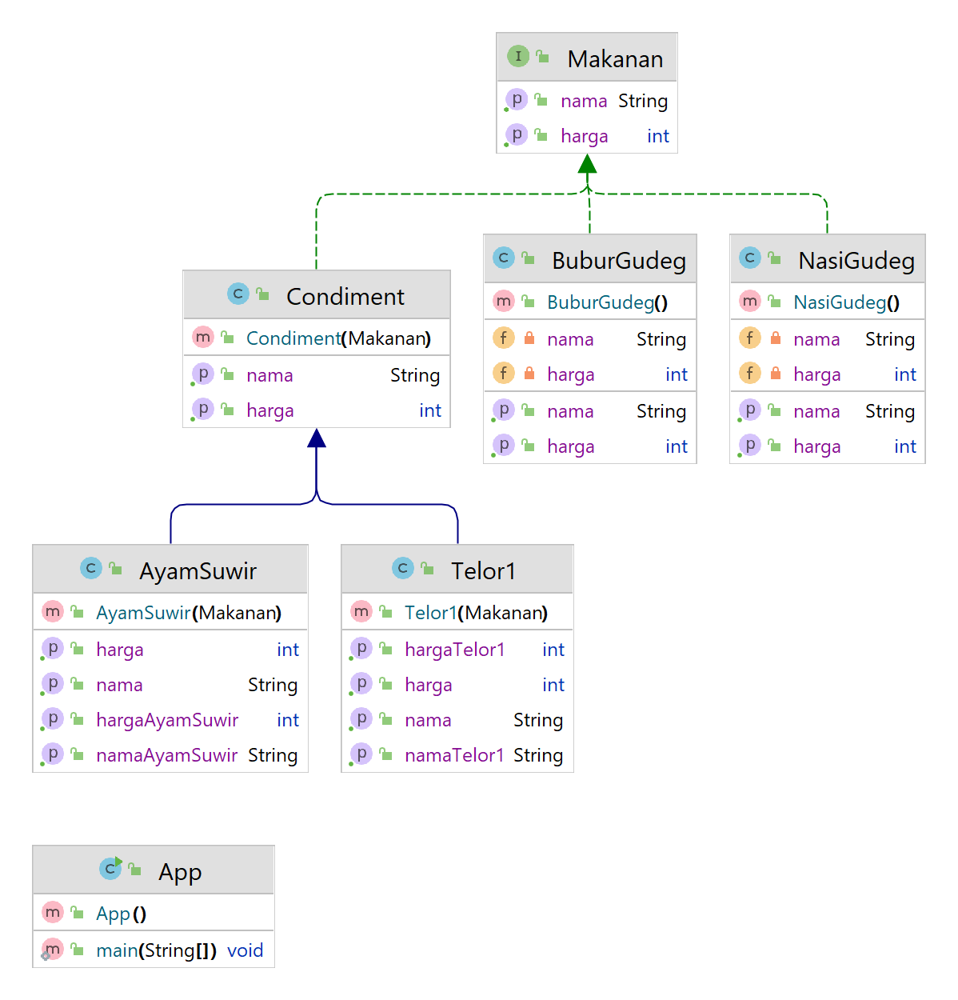

# [BOBOT 50 – GUDEG POLIMORFISME]
Yogyakarta terkenal sebagai kota gudeg, banyak warung gudeg yang ada di kota ini.  Anda diminta untuk membuat sebuah program Java untuk menghitung harga menu dari sebuah warung Gudeg Jogja.  Warung ini menjual menu dasar dua macam yaitu Nasi Gudeg dan Bubur Gudeg.  Kondimen atau tambahan lauknya adalah Ayam Suwir dan Telor 1 buah masing-masing dengan harga yang berbeda-beda.  Untuk membantu anda berikut adalah class diagram yang harus dibuat menjadi class dan obyek:

</img>

# Penjelasan:
1.	Interface Makanan hanya berisi method String getNama() dan int getHarga() untuk suatu makanan.
2.	NasiGudeng implements dari Makanan yang berisi konstanta nama “nasi gudeg” dan harga 5000.  Buatlah getter dan setternya!
3.	BuburGudeg implements dari Makanan yang berisi konstanta nama “bubur gudeg” dan harga 4000. Buatlah getter dan setternya!
4.	Class Condiment digunakan untuk lauk tambahan dengan harga tertentu.  Condiment memiliki konstruktor yang menerima Makanan, getHarga dan getNama dari makanan.
5.	Class AyamSuwir adalah lauk yang ekstends dari Condiment dengan nama “ayam suwir” dan harga 6000.  Saat memanggil getHarga maka program akan mengambil harga dari parentnya ditambah dengan harga ayam suwir (yaitu 6000) sehingga nanti bisa diperoleh total harganya.  
6.	Class Telor1 adalah lauk yang ekstends dari Condiment dengan nama “telor 1” dan harga 4000.  Saat memanggil getHarga maka program akan mengambil harga dari parentnya ditambah dengan harga telor 1 (yaitu 4000) sehingga nanti bisa diperoleh total harganya.  
7.	Class App adalah class main tempat mencoba dan menjalankan program.

Contoh:

	Makanan ays = new AyamSuwir(new Telor1(new NasiGudeg()));
	System.out.println("Makanan: "+ays.getNama());
	System.out.println("Total: "+ays.getHarga());

	Makanan ba = new AyamSuwir(new BuburGudeg());
	System.out.println("Makanan: "+ba.getNama());
	System.out.println("Total: "+ba.getHarga());

Maka outputnya adalah:

	Makanan: nasi gudeg telor 1 ayam suwir
	Total: 15000
	Makanan: bubur gudeg ayam suwir
	Total: 10000

Keterangan:

	Harga 15000 adalah dari 5000 (nasi gudeg) + 4000 (telor1) dan 6000 (dari ayam suwir)
	Harga 10000 adalah dari 4000 (bubur gudeg) + 6000 (dari ayam suwir)

Tambahkan 1 menu lagi yaitu Krecek dengan harga 3500!  Cobalah:

	Makanan bak = new Telor1(new Krecek(new BuburGudeg()));
	System.out.println("Makanan: "+bak.getNama());
	System.out.println("Total: "+bak.getHarga());

Output: 

	Makanan: bubur gudeg krecek telor 1
	Total: 11500
